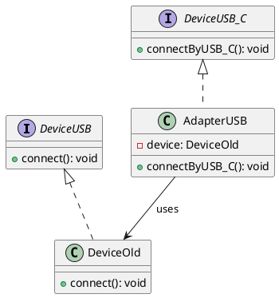

# Diagrama de clases adapater

# Diagrama de clases Facade
```plantuml
class MusicPlayer {
    - playerMP3: MP3Player
    - volumeControl: VolumeControl
    - equalizer: Equalizer
    + MusicPlayer()
    + play(file: String): void
    + stop(): void
    + adjustVolume(level: int): void
    + adjustEqualizer(bajo: int, medio: int, alto: int): void
}

class MP3Player {
    + playFile(file: String): void
    + stopPlayback(): void
}

class VolumeControl {
    - nivel: int
    + setNivel(nivel: int): void
}

class Equalizer {
    - bajo: int
    - medio: int
    - alto: int
    + setBajo(bajo: int): void
    + setMedio(medio: int): void
    + setAlto(alto: int): void
}

MusicPlayer *-- MP3Player
MusicPlayer *-- VolumeControl
MusicPlayer *-- Equalizer
```


